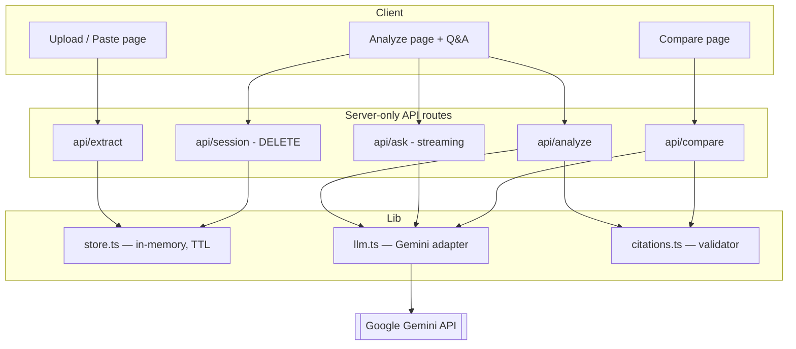

# ClauseCompass — Legal Document Navigator

> Upload a contract, lease, or agreement. Get a plain-language Decision Map where every claim links to the exact source text. Information only, never legal advice.

## What It Does

| Problem Statement Use Case | Feature |
|---|---|
| Simplifying complex legal documents | Decision Map with plain-language claims and severity badges |
| Comparing contracts or policies | Two-document clause comparison (added/removed/changed) |
| Highlighting obligations and risks | 6-category grouped view with risk flags |
| Answering questions from documents | Grounded Q&A with streaming — answers only from the document |
| Helping users prepare for a lawyer | Auto-generated neutral questions for attorney consultations |
| **Access for non-English speakers** | **Analysis, risk explanations, and Q&A in 7 languages (Hindi, Bengali, Tamil, Telugu, Marathi, Spanish, English) — while source citations stay verbatim so verification never breaks** |
| **Access without a digital copy** | **Photograph or scan a paper contract — Gemini vision OCR transcribes it into the same citation-validated pipeline** |

## Evaluation Criteria Alignment

| Criterion | How ClauseCompass Addresses It |
|---|---|
| **Code Quality** | TypeScript strict mode, ESLint zero-warning, Zod validation at every I/O boundary, modular single-responsibility lib files, JSDoc on all public APIs |
| **Security** | Server-only API keys, CSP without `unsafe-eval`, rate limiting with secure IP parsing (last hop, not spoofable first), upload validation (type/size/page limits), prompt injection defense, non-root Docker container, gitleaks in CI |
| **Efficiency** | Gemini Flash with 1M-token context (no RAG/vector DB needed), in-memory store with 30-min TTL and periodic garbage collection, Next.js standalone build for minimal container size, parallel document uploads in compare view |
| **Testing** | 71 Vitest tests across 8 suites — citation validation, schema boundaries, rate limiting, document storage, risk scoring, and **API-route integration tests** (extract validation + vision path, analyze citation-verification and caching). CI runs lint + typecheck + test + build + secret scanning on every push |
| **Accessibility** | Semantic HTML5 (`<main>`, `<section>`, `<nav>`), ARIA attributes (`aria-live`, `aria-selected`, `role="tablist"`), keyboard-navigable with visible focus rings, dark mode via `prefers-color-scheme`, `prefers-reduced-motion` support, skip-to-content link |
| **Problem Statement Alignment** | Directly addresses 6 of the listed use cases for "AI for Legal Assistance & **Access**": simplifying legal documents, comparing contracts, highlighting obligations/risks, answering questions from documents, preparing users for attorney consultations, and **multilingual access** so non-English speakers can understand what they are signing. Every AI output is grounded via deterministic citation validation |

## How It Works

1. Upload a PDF or paste text
2. Gemini extracts clauses as structured JSON with exact source quotes
3. The **citation validator** string-matches every quote against the original document text (NFKC-normalized, smart-quote folded, cross-page aware)
4. Only verified claims render with citation chips. Unverifiable quotes are labeled, never presented as fact.

See [`lib/citations.ts`](lib/citations.ts) for the validator and [`tests/citations.test.ts`](tests/citations.test.ts) for the test suite.

## Architecture



Every AI output (`analyze`, `compare`) passes `citations.ts` before rendering — no claim reaches the UI without an exact quote match back into the source. `lib/` also holds `schemas.ts` (Zod, single source of truth), `extract.ts` (pdfjs-dist), `risk.ts` (risk score), and `ratelimit.ts` (per-IP token bucket). Tests: 71 across 8 Vitest suites, including API-route tests.

**Key decisions:**
- **No database** — documents live in memory with a 30-minute TTL and periodic cleanup. Privacy by design, not a limitation.
- **No RAG/vector DB** — Gemini's 1M-token context window takes the full document. Grounding comes from the citation validator, not retrieval.
- **Server-only AI** — API keys never reach the client.
- **Dark mode** — respects `prefers-color-scheme` via CSS custom properties.

## Setup

```bash
git clone <repo-url> && cd clausecompass
npm install
cp .env.example .env.local  # add your GEMINI_API_KEY
npm run dev
```

## Quality Checks

```bash
npm run lint        # ESLint
npm run typecheck   # TypeScript strict mode
npm test            # 71 Vitest tests
npm run build       # Production build
```

## Testing

71 tests across 8 files:

| Suite | Tests | Covers |
|---|---|---|
| `citations.test.ts` | 17 | Exact match, whitespace/case normalization, smart-quote folding, em-dash normalization, cross-page matching, fabricated-tail rejection, offset validation, precomputed full-text optimization |
| `schemas.test.ts` | 9 | Claim/DecisionMap/QA validation, optional severity, all categories, invalid rejection |
| `ratelimit.test.ts` | 10 | Threshold, blocking, per-IP isolation, window reset, `parseClientIp` with comma-separated headers and whitespace trimming |
| `store.test.ts` | 9 | Document CRUD, decision map storage, TTL expiry, nonexistent doc handling, overwrite behavior, no-op on missing doc |
| `extract.test.ts` | 5 | Text extraction, whitespace preservation, empty input, large input, unicode content |
| `risk.test.ts` | 5 | Risk scoring — empty, high-severity weighting, cap at 10, low-risk clean doc, unverified-citation penalty |
| `api/extract.test.ts` | 6 | Upload validation (missing input, oversized text, too-short, bad type) and the image→vision-OCR path |
| `api/analyze.test.ts` | 4 | Invalid body, unknown doc, real-vs-fabricated citation verification, decision-map caching |

CI runs lint + typecheck + test + build + gitleaks on every push.

## Security

- **Server-only keys** — `GEMINI_API_KEY` in env, never in client code
- **CSP** — `script-src 'self' 'unsafe-inline'`; `frame-ancestors 'none'`; no `unsafe-eval`
- **X-Forwarded-For parsing** — takes the last (load-balancer-added) IP, not the first (client-spoofable)
- **Rate limiting** — 20 req/min per IP with periodic bucket cleanup
- **Upload validation** — type, size (10 MB), page count (100), minimum content length
- **Prompt injection defense** — system instruction treats document content as data; user-controlled filenames sanitized before prompt interpolation
- **Strict input validation** — client request schemas use Zod `.strict()` (rejects unexpected keys); JSON bodies capped at 1 MB (413)
- **Bounded memory** — document store and rate-limit buckets are size-capped (evict-oldest) to resist floods
- **No route caching** — every LLM route is `force-dynamic` so Gemini is genuinely invoked per request (never served stale)
- **Memory cleanup** — periodic `setInterval` purge of expired sessions and rate-limit buckets
- **Non-root container** — Dockerfile runs as `nextjs` user
- **Secret scanning** — gitleaks in CI

## Privacy

- Documents processed in memory only, auto-purged every 60 seconds for expired sessions
- Delete button available in the UI
- No database, no file system persistence, no analytics, no tracking

## GenAI Services Disclosure

**Google Gemini 3.6 Flash** via `@google/generative-ai`, server-side only:

1. Structured clause extraction and Decision Map generation
2. Grounded document Q&A with streaming
3. Two-document clause comparison with citation validation
4. Neutral lawyer-question generation
5. Multilingual output (7 languages) for the Decision Map and Q&A — explanations are translated while source quotes stay verbatim
6. Vision OCR — transcribe a photographed or scanned contract (image) into text for the same citation-validated pipeline

All model output passes the citation validator before rendering.

## Limitations

- PDF, plain text, and images/photos (PNG/JPG/WebP via Gemini vision OCR); no DOCX yet
- In-memory store — documents lost on server restart
- Max 100 pages per document (single image per upload)

## License

MIT
